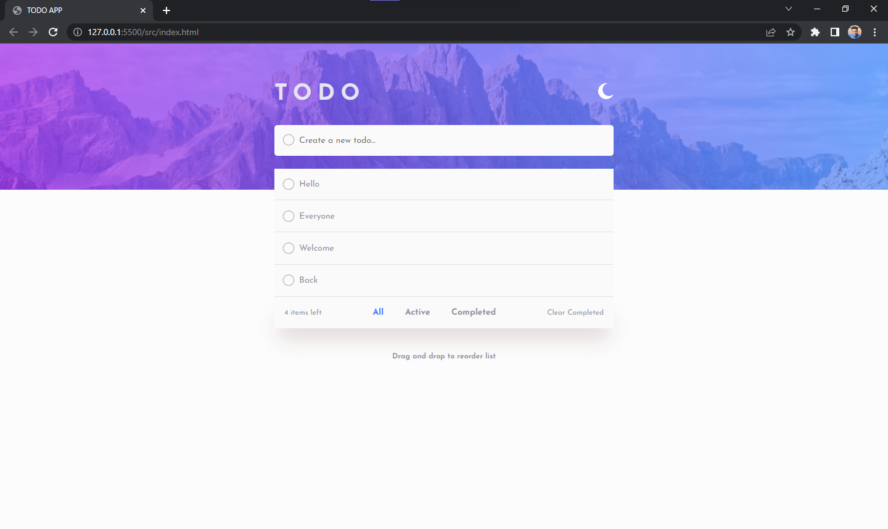
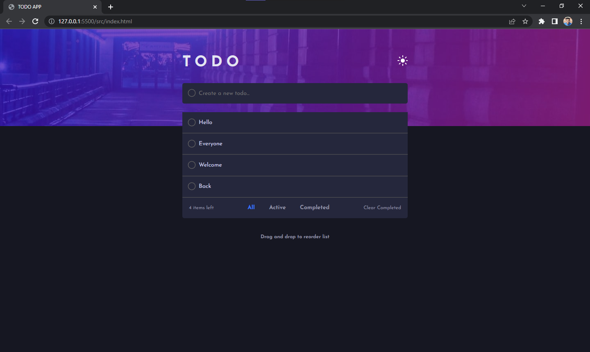
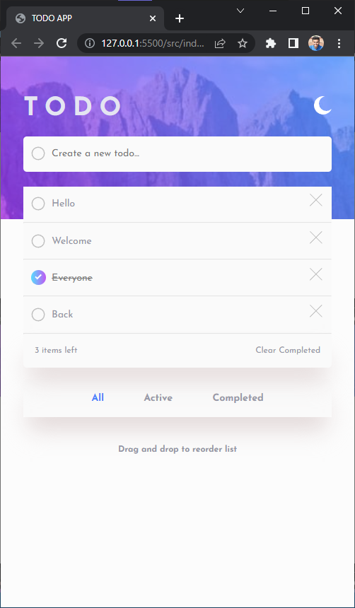
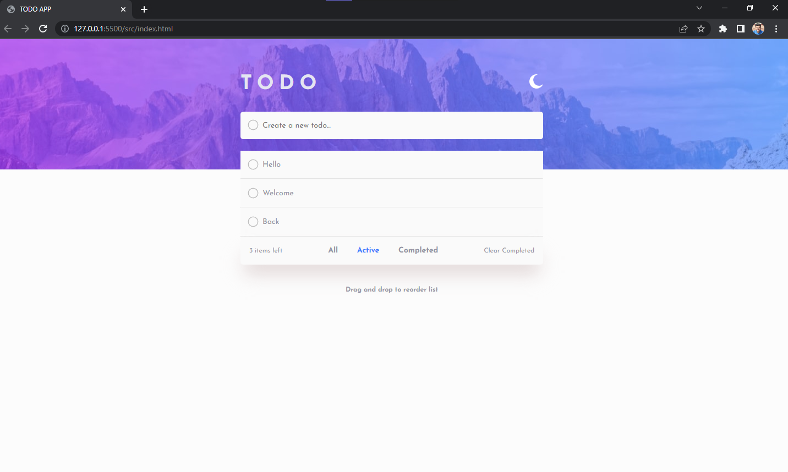
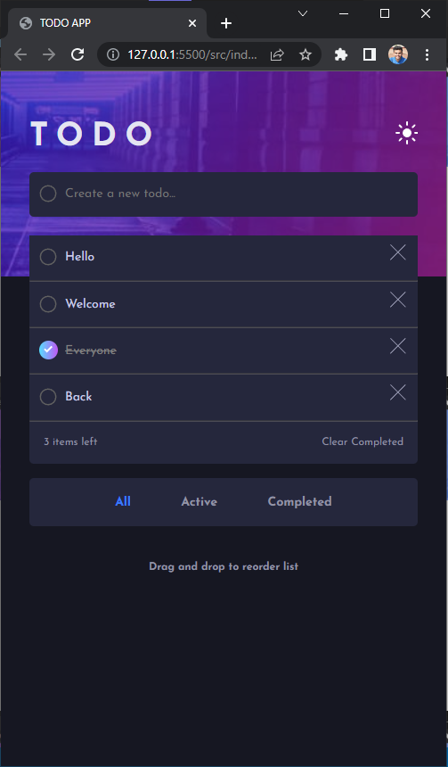
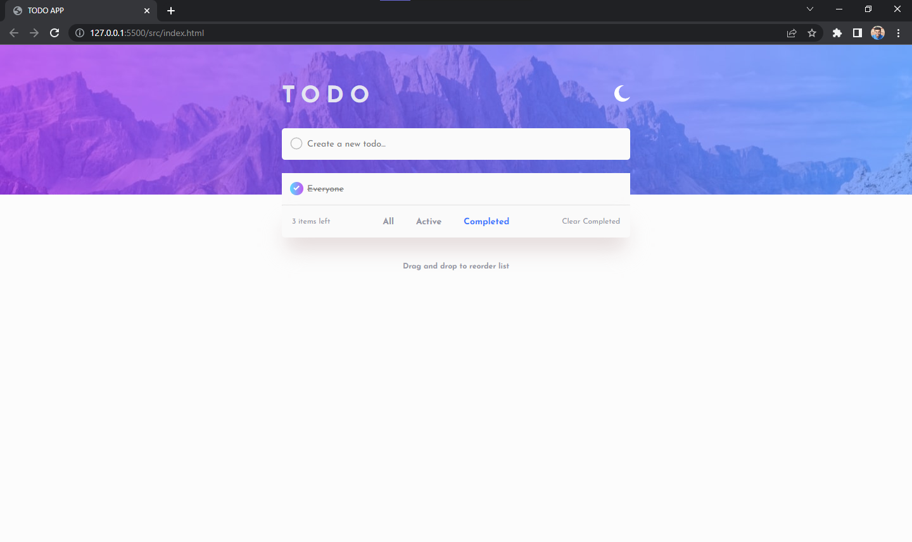

# Frontend Mentor - Todo app solution

This is a solution to the [Todo app challenge on Frontend Mentor](https://www.frontendmentor.io/challenges/todo-app-Su1_KokOW). Frontend Mentor challenges help you improve your coding skills by building realistic projects.

## Table of contents

- [Overview](#overview)
  - [The challenge](#the-challenge)
  - [Screenshot](#screenshot)
  - [Links](#links)
- [My process](#my-process)
  - [Built with](#built-with)
  - [What I learned](#what-i-learned)
  - [Useful resources](#useful-resources)
- [Author](#author)

## Overview

### The challenge

Users should be able to:

- View the optimal layout for the app depending on their device's screen size
- See hover states for all interactive elements on the page
- Add new todos to the list
- Mark todos as complete
- Delete todos from the list
- Filter by all/active/complete todos
- Clear all completed todos
- Toggle light and dark mode
- **Bonus**: Drag and drop to reorder items on the list

### Screenshot

<table>
 <tr>
    <td><b style="font-size:20px">Design</b></td>
    <td><b style="font-size:20px">Desktop</b></td>
 </tr>
 <tr>
    <td>
		
</td>
    <td>
    	
    	
		</td>
 </tr>
  <tr>
    <td><b style="font-size:20px">Functionality</b></td>
    <td><b style="font-size:20px">Mobile</b></td>
 </tr>
 <tr>
  <td>
    
  </td>
  <td>
    
  </td>
 </tr>
 <tr>
  <td>

  </td>
  <td>

  </td>
 </tr>
  <tr>
  <td>
  

</td>
  </tr>
</table>

### Links

- Solution URL: [Github-repo](https://github.com/therahulchaurasia/To-do-fm)
- Live Site URL: [Netlify](https://rc-to-do-fm.netlify.app)

## My process

1.  Firstly I created the mobile UI for light scheme with just HTML and CSS.
2.  Then the next step was to add the toggle for dark theme.
3.  Worked on the desktop UI.
4.  Added the required functionality in the list
5.  Worked on drap and drop feature on the list

### Built with

- Semantic HTML5 markup
- CSS custom properties
- Flexbox
- Mobile-first workflow

### What I learned

### This project was a pretty cool experience and there were multiple moving parts which had to be handled and I was able to handle them successfully. While building the project I learned the drag and drop feature and it's working and implemented it into the project. Used the localstorage functionality as well

<hr>

- New CSS property that I used

```css
.main-input {
  caret-color: red; //let's you change the input cursor's(caret) color
}
```

### Useful resources

- [MDN web docs](https://developer.mozilla.org/en-US/docs/Web/JavaScript) - Used the docs to check various properties, their working and features.
- [For drag and drop](https://www.youtube.com/watch?v=wv7pvH1O5Ho) - This is an amazing where I learned the drag and drop properties and used them in my project.

## Author

- Frontend Mentor - [@therahulchaurasia](https://www.frontendmentor.io/profile/therahulchaurasia)
